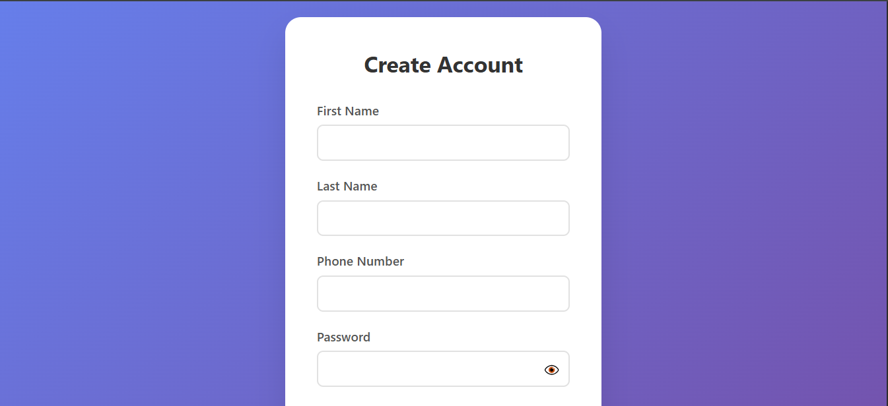
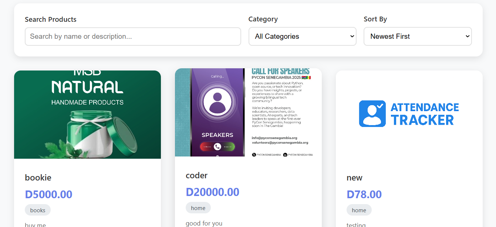

# 📊 Market Place  

**Hackathon Project — MyFarm Dev**  

## 🚀 Problem & 💡 Solution  
In many local markets, it’s hard to compare prices or even find who is selling goods. Our project solves this by putting products and seller information in one place, so buyers can easily find what they need and contact the seller.


---

## ✨ Key Features  
- 📌 Online Market Where buyers can views the products 
- 📊 Price history & trends  
- 👥 Multi-role access: traders, admins, public  
- 📱 Mobile-friendly UI
- NOTE THEY CAN'T DO ONLINE PAYMENT

---

## 🛠️ Tech Stack  
- **Backend:** Django  
- **Frontend:** HTML, CSS, JavaScript, Bootstrap  
- **Database:**  SQLite  
- **Hosting:** Render  

--- 
# Demo pages
Visit the site: [Market Place](https://market-tracker-onzf.onrender.com/)

## Register Page 

If you register as a client you can only view products.
But if you register as a seller you can post products and view them

## Log In Page


## Products Pages

---

## ⚡ Quick Start  
```bash
      git clone https://github.com/<your-username>/myfarm-market-price-tracker.git
      cd myfarm-market-price-tracker
      pip install -r requirements.txt
      python manage.py migrate
      python manage.py runserver

